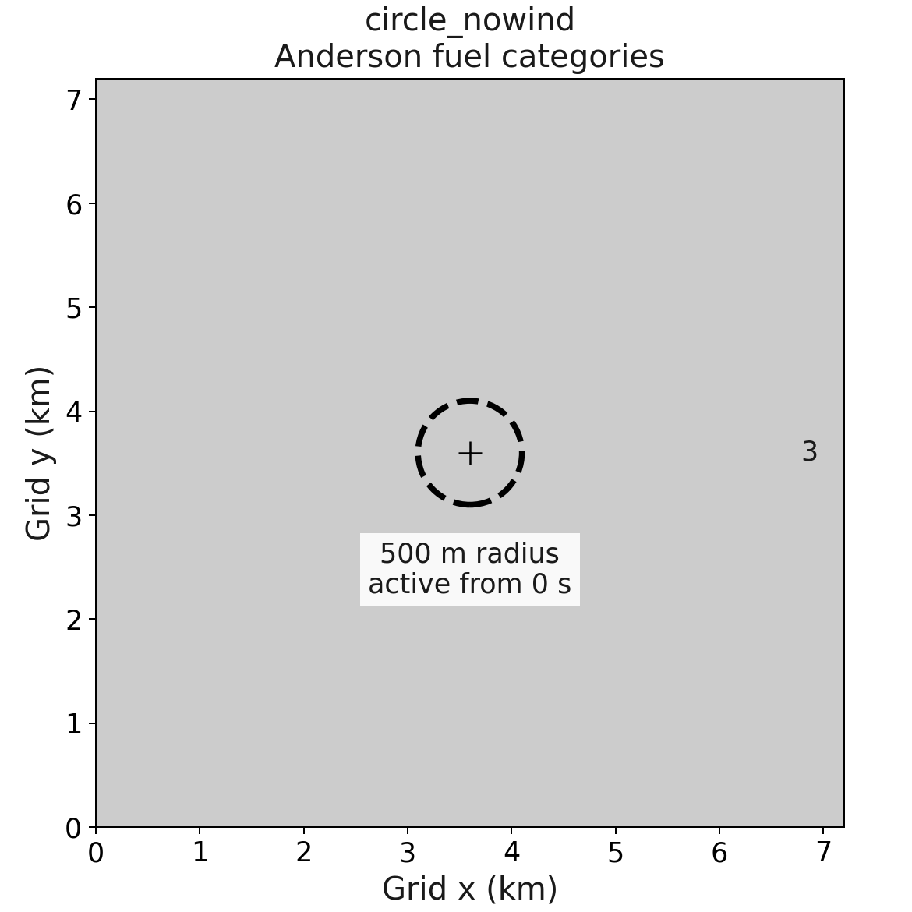
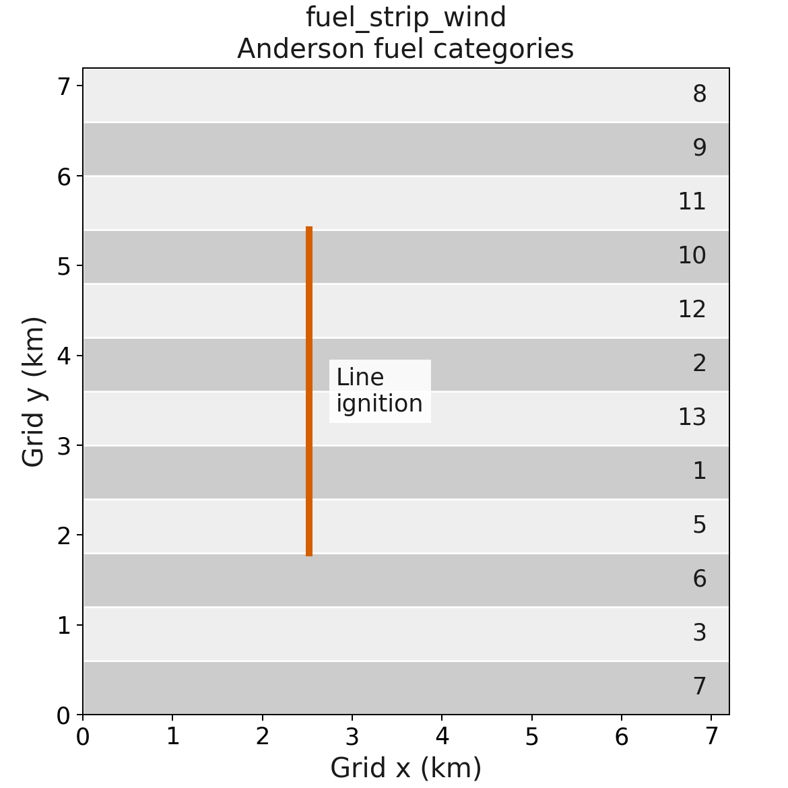
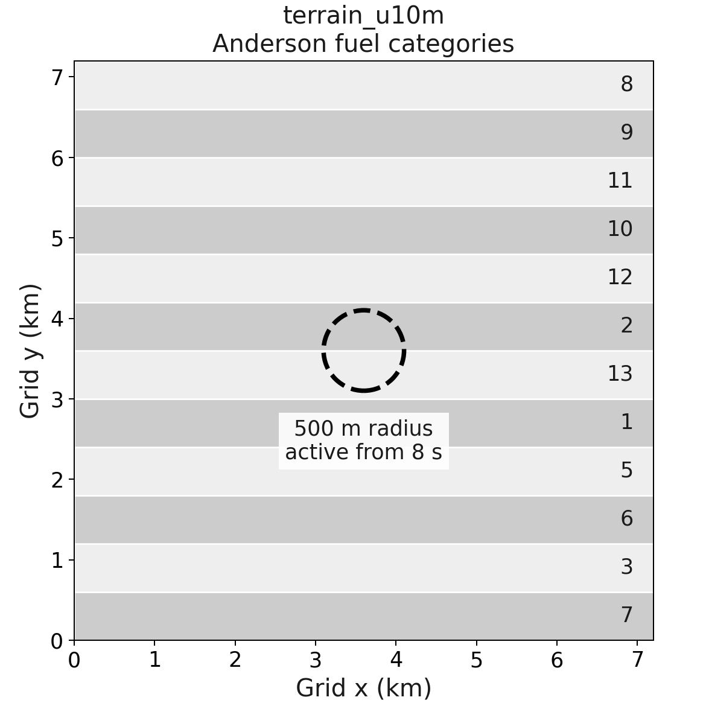
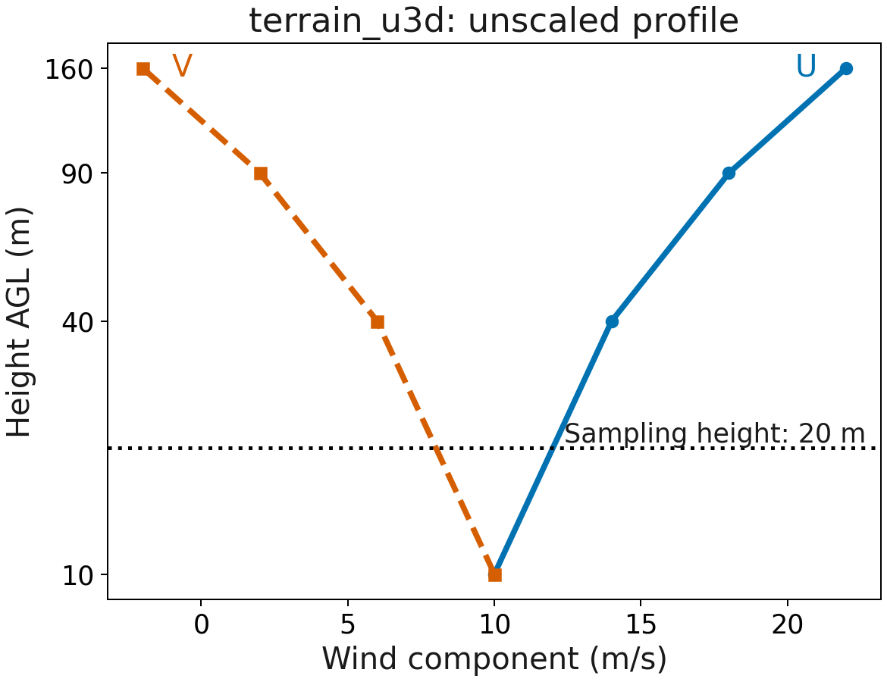

# Scientific cases

[Documentation index](../README.md)

## Cases and forcing

| Case | Purpose |
| --- | --- |
| `circle_nowind` | Idealized point ignition and uniform Anderson fuel |
| `fuel_strip_wind` | Line ignition, twelve fuel categories, nearest interpolation |
| `terrain_u10m` | Terrain, twelve fuel strips, delayed observed perimeter, varying moisture, terrain-dependent 10 m winds |
| `terrain_u3d` | Same terrain experiment with a terrain-dependent vertical wind profile |

The shared configuration uses a 72 x 72 fire grid, 100 m spacing, 4 s timesteps,
and 60 s integrations. NUOPC and ESMX run both terrain cases with generated
WRF-data forcing. All real-case forcing includes staggered U/V and PH/PHB,
because the NUOPC WRF-data component reads both wind representations.

The atmospheric grid extends beyond the fire grid. This makes every fire cell
an interpolation target inside the forcing domain, avoiding unmapped coupled
boundary cells.

Both terrain cases multiply prescribed winds by
`1 + wind_terrain_gradient_per_m * (height - terrain.base_elevation_m)`.
The gradient is 0.001 per meter, giving approximately 15% weaker winds in
valleys and 15% stronger winds on hills around the 1600 m reference elevation.
This is deterministic synthetic forcing, not a terrain-flow parameterization.
Terrain is averaged onto mass centres for U10/V10 and onto the respective
U/V faces for 3D winds. The same factor multiplies all vertical levels.

The 3D case samples the shear profile at 20 m, between mass levels at 10 and
40 m. Its unscaled analytical wind is `(12, 8)` m/s. Spatial interpolation
and destaggering affect the terrain-dependent result, so the variable-wind
case checks its prescribed component bounds and nonzero spatial variation.
Cross-execution and cross-driver comparisons retain their numerical tolerance.
Setting the gradient to zero restores the exact uniform-profile check at
rtol=1e-4, atol=0; Python tests retain that control. Neither experiment equates
the 3D wind with the fuel-adjusted 10 m wind or requires their fire outputs
to match. Existing uniform-wind reference candidates do not certify these cases.

Staggering is a property of the atmospheric host: this WRF-data fixture uses
native WRF staggering, while UFS can supply mass-centred winds. Both current
WRF-data readers destagger before subsequent processing. These tests do not
validate UFS imports or establish one staggering convention as universally
preferable.

Each case requires the expected output timestamps, field schema and metadata,
finite values, evolving level set, fuel consumption, positive fire fluxes,
and the configured moisture/perimeter behavior, and nonzero surface winds with
the prescribed direction on every fueled cell. Coupled cases also require
the driver's completion marker. A zero process exit alone is insufficient.

Standalone and the coupled drivers save atmospheric fields used during the
completed fire interval. With 4 s fire and atmospheric intervals, output at
60 s contains the 56 s forcing record. The forcing is refreshed for the next
advance after output; the atmospheric checks use this shared convention.

Generated atmospheric `XLAT` and `XLONG` use float64 and the model reader
preserves them into the ESMF cell-centre grid. Forcing fields, saved model fields,
and fire-grid coordinates retain their existing storage precision. The model's
remaining-fuel and timestep-consumption arithmetic uses float64 internally.
Legacy float32 coordinates are
still accepted, but conversion to float64 cannot recover lost precision.

### Deferred

The humidity interpretation remains the separate scientific review tracked
by PR #46. Restart, PR #39, and method `(4,5)` remain deferred. `testx` remains
in the legacy route; generated tests exercise the WRF-data coupling, not the
ESMX_Data feedback fixture.

## Configuration figures

These figures describe prescribed inputs and ignition geometry. They are not
simulated fire perimeters. The plotting script reads the current YAML and uses
the input generator's terrain/fuel arrays. Projected x/y distances are in km.

### Zero-wind circular ignition

`circle_nowind` has flat terrain at 0 m, Anderson category 3, and zero wind.
The central point ignition has a 500 m maximum radius and is prescribed from
0 to 2 s. The dashed circle marks that radius, not the final burned area.
This idealized case reads neither WRF nor geogrid files.

### Fuel strips with 10 m wind

`fuel_strip_wind` uses flat terrain and twelve Anderson categories, each occupying
six rows at standard resolution. Strips vary along y and extend across x.
Numbers label categories directly. The line is at 35% of domain width, spanning
25% to 75% of domain height, with a 100 m ignition radius. The prescribed wind
is U10 = 10 m/s, V10 = 0 m/s before fuel adjustment, using nearest horizontal
interpolation. Ignition is prescribed from 0 to 2 s.

### Terrain cases

Both terrain cases use a 1600 m base elevation, 150 m sinusoidal amplitude,
and 6 km wavelengths in x and y. The supplied 500 m observed perimeter becomes
active at 8 s. The initial saved state is checked for inactivity.

The terrain cases share the twelve fuel strips shown above, with moisture
updated each fire timestep. The terrain configurations differ in their selected
wind representation, not fuel or ignition geometry.

`terrain_u3d` uses mass-level heights of 10, 40, 90, and 160 m above ground,
from interfaces at 0, 20, 60, 120, and 200 m. The logarithmic height axis makes
the log-height interpolation explicit: at 20 m, unscaled U = 12 m/s and
V = 8 m/s. The terrain factor multiplies every level.
`terrain_u10m` instead prescribes U10 = V10 = 10 m/s multiplied by the same
terrain factor, then applies fuel-dependent wind adjustment in the model.
These two cases are not expected to produce identical fire winds or spread.

## Shared schedules and controls

| Setting | Standard cases | Full experiments |
| --- | --- | --- |
| Fire grid | 72 × 72 at 100 m | 320 × 320 at 25 m |
| Duration and timestep | 60 s, 4 s | 3600 s, 2 s |
| Saved times | 0 and 60 s | 0, 900, 1800, 2700, 3600 s |
| Atmospheric interval | 4 s | 60 s |
| Methods | `(9,4)` | `(9,4)` and `(2,4)` |

The terrain forcing warms from 300 to 302 K and dries from mixing ratio
0.008 to 0.004 kg/kg across the configured duration. Surface pressure is
90000 Pa and precipitation is zero. Roughness varies from 0.05 to 0.25 m
across the atmospheric domain. At standard resolution, the padded forcing
grid has 75 × 75 mass centres, U has 75 × 76 horizontal points, and V has
76 × 75. Array axes here are (y, x). Atmospheric latitude/longitude are float64.

All cases start on 2020-01-01 at 00:00:00. The real-case Lambert projection is
centred at 40°N, 105°W with standard parallels 30°N and 60°N. See
[cases.yaml](../cases.yaml) for complete settings and
[generate_inputs.py](../generate_inputs.py) for schema and staggering.

Regeneration instructions are in the [contributor guide](contributing.md#regenerate-case-figures).
