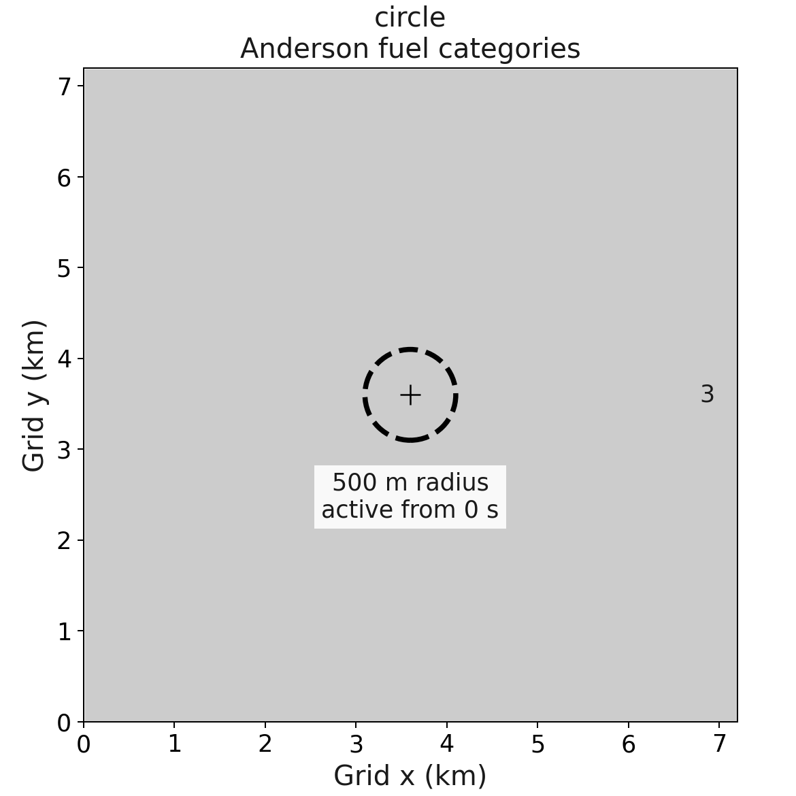
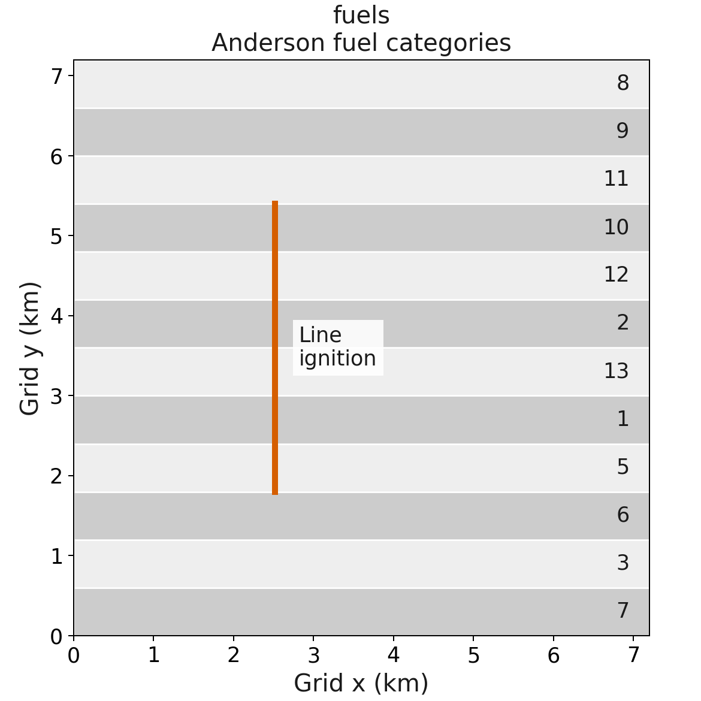
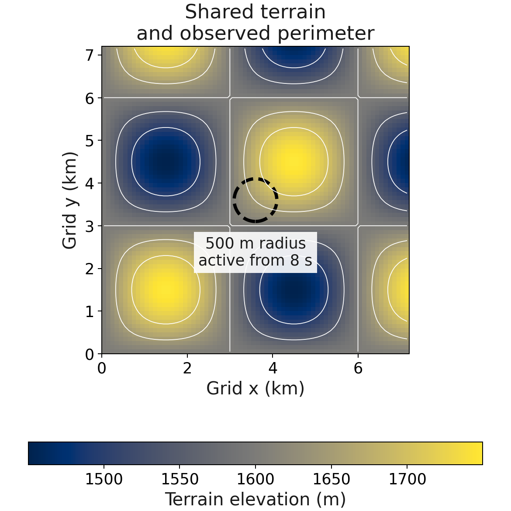
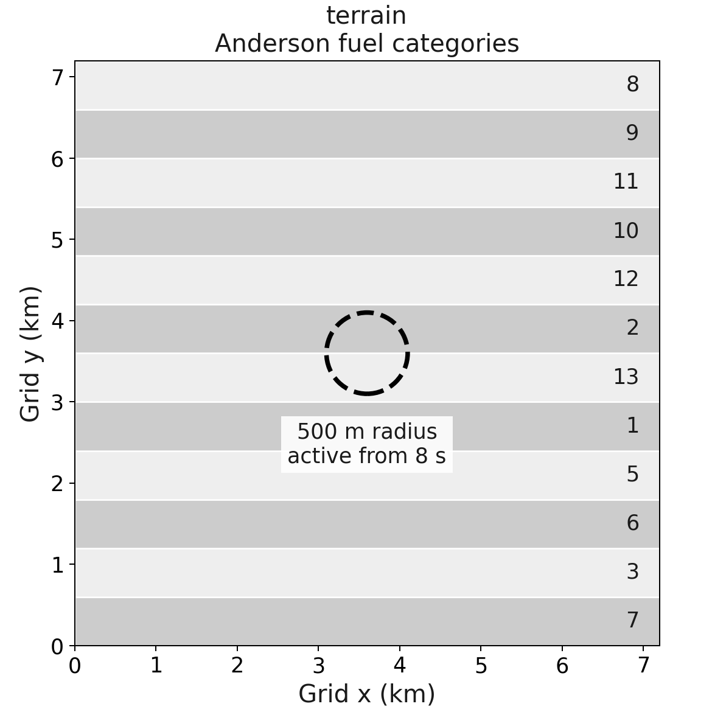
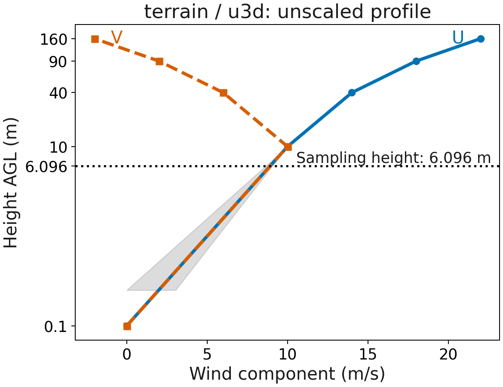

# Scientific cases

[Documentation index](../README.md)

## Cases and forcing

Three cases share defaults in one YAML file. Named configurations select
scientific options within each case; see [configuration.md](configuration.md).

| Case | Purpose |
| --- | --- |
| `circle` | Idealized point ignition and uniform Anderson fuel |
| `fuels` | Line ignition, twelve fuel categories, nearest interpolation |
| `terrain` / `u10m` | Terrain, twelve fuel strips, delayed observed perimeter, varying moisture, terrain-dependent 10 m winds |
| `terrain` / `u3d` | Same terrain experiment with a terrain-dependent vertical wind profile |

The shared configuration uses a 72 x 72 fire grid, 100 m spacing, 4 s timesteps,
and 60 s integrations. NUOPC and ESMX run both terrain wind configurations with generated
WRF-data forcing. All real-case forcing includes staggered U/V and PH/PHB,
because the NUOPC WRF-data component reads both wind representations.

The atmospheric grid extends beyond the fire grid. This makes every fire cell an
interpolation target inside the forcing domain, avoiding unmapped coupled
boundary cells.

Both terrain wind configurations multiply prescribed winds by `1 + wind_terrain_gradient_per_m
* (height - terrain.base_elevation_m)`. The gradient is 0.001 per meter, giving
approximately 15% weaker winds in valleys and 15% stronger winds on hills around
the 1600 m reference elevation. This is deterministic synthetic forcing, not a
terrain-flow parameterization. Terrain is averaged onto mass centres for U10/V10
and onto the respective U/V faces for 3D winds. The same factor multiplies all
vertical levels.

The 3D configuration samples at **6.096 m**, below the first 10 m mass level.
The surface branch in `share/interp_mod.F90` uses
`U = U_first * log(6.096 / z0) / log(10 / z0)`, and the same expression for V.
For an unscaled first-level wind of 10 m/s and z0 from 0.05 to 0.25 m, the
result is approximately 9.07 to 8.66 m/s before terrain scaling. The check uses
the saved cell roughness and the prescribed terrain-factor bounds, and requires
spatial variation. A uniform-profile control checks the analytical value with
rtol=1e-4, atol=0. The separate 20 m unit-test control exercises interpolation
between mass levels, where unscaled (U, V) = (12, 8) m/s.

For 3D winds, both drivers first remap the wind and geopotential profiles
horizontally to the fire grid, then sample vertically using mapped roughness.
PR #57 applies this order to standalone; previously it sampled vertically on
the atmospheric grid first. The logarithmic surface calculation is nonlinear,
so reversing these operations can change the result. Matching the order does
not make the two horizontal interpolation implementations bitwise identical.

Neither configuration equates 3D winds with fuel-adjusted 10 m winds. Their
fire outputs are not expected to match each other. Cross-execution and
cross-driver tolerances are unchanged. Earlier 20 m outputs do not validate
the revised 6.096 m configuration.

Staggering is a property of the atmospheric host: this WRF-data fixture uses
native WRF staggering, while UFS can supply mass-centred winds. Both current
WRF-data readers destagger before subsequent processing. These tests do not
validate UFS imports or establish one staggering convention as universally
preferable.

Each case requires the expected output timestamps, field schema and metadata,
finite values, evolving level set, fuel consumption, positive fire fluxes, and
the configured moisture/perimeter behavior. Real cases also check the prescribed
wind direction and component bounds, including nonzero components where the
forcing is nonzero. Coupled cases also require the driver's completion marker. A
zero process exit alone is insufficient.

Standalone and the coupled drivers save atmospheric fields used during the
completed fire interval. With 4 s fire and atmospheric intervals, output at 60 s
contains the 56 s forcing record. The forcing is refreshed for the next advance
after output; the atmospheric checks use this shared convention.

Generated atmospheric `XLAT` and `XLONG` use float64 and the model reader
preserves them into the ESMF cell-centre grid. Forcing fields, saved model
fields, and fire-grid coordinates retain their existing storage precision. The
model's remaining-fuel and timestep-consumption arithmetic uses float64
internally. Legacy float32 coordinates are still accepted, but conversion to
float64 cannot recover lost precision.

See [deferred work](deferred.md) for coverage outside these configurations.

## Configuration figures

These figures describe prescribed inputs and ignition geometry. They are not
simulated fire perimeters. The plotting script reads the current YAML and uses
the input generator's terrain/fuel arrays. Projected x/y distances are in km.

### Zero-wind circular ignition

`circle` has flat terrain at 0 m, Anderson category 3, and zero wind. The
central point ignition has a 500 m maximum radius and is prescribed from 0 to 2
s. The dashed circle marks that radius, not the final burned area. This
idealized case reads neither WRF nor geogrid files.

### Fuel strips with 10 m wind

`fuels` uses flat terrain and twelve Anderson categories, each
occupying six rows at small scale. Strips vary along y and extend across
x. Numbers label categories directly. The line is at 35% of domain width,
spanning 25% to 75% of domain height, with a 100 m ignition radius. The
prescribed wind is U10 = 10 m/s, V10 = 0 m/s before fuel adjustment, using
nearest horizontal interpolation. Ignition is prescribed from 0 to 2 s.

### Terrain cases

Both terrain wind configurations use a 1600 m base elevation, 150 m sinusoidal amplitude, and
6 km wavelengths in x and y. The supplied 500 m observed perimeter becomes
active at 8 s. The initial saved state is checked for inactivity.

The terrain configurations share the twelve fuel strips shown above, with moisture
updated each fire timestep. The terrain configurations differ in their selected
wind representation, not fuel or ignition geometry.

`terrain` / `u3d` supplies mass-level heights 10, 40, 90, and 160 m above
ground, from interfaces at 0, 20, 60, 120, and 200 m. The figure extends the
profile to zero wind at representative roughness z0 = 0.1 m. The grey band
shows the surface-profile range for configured z0 = 0.05 to 0.25 m. The terrain
factor multiplies every level. `u10m` instead uses U10 = V10 = 10 m/s times
the terrain factor and applies fuel-dependent wind adjustment in the model.

## Shared schedules and controls

| Setting | `small` scale | `large` scale |
| --- | --- | --- |
| Fire grid | 72 × 72 at 100 m | 320 × 320 at 25 m |
| Duration and timestep | 60 s, 4 s | 3600 s, 2 s |
| Saved times | 0 and 60 s | 0, 900, 1800, 2700, 3600 s |
| Atmospheric interval | 4 s | 60 s |
| Suites selecting this scale | `quick`, `pr` | `full` |
| Selected numerical pairs | `(9,4)` | `(9,4)` and `(2,4)` |

The default `fire_upwinding=9` selects hybrid WENO5/ENO1, with fifth-order
reconstruction near the front. Small forcing differences can affect the level
set and subsequent consumption. A controlled comparison with the existing
Godunov configuration remains planned; its effect on the residual
standalone/coupled discrepancy has not been isolated. The short-suite method
is unchanged.

The terrain forcing warms from 300 to 302 K and dries from mixing ratio 0.008 to
0.004 kg/kg across the configured duration. Surface pressure is 90000 Pa and
precipitation is zero. Roughness varies from 0.05 to 0.25 m across the
atmospheric domain. At small scale, the padded forcing grid has 75 × 75
mass centres, U has 75 × 76 horizontal points, and V has 76 × 75. Array axes
here are (y, x). Atmospheric latitude/longitude are float64.

All cases start on 2020-01-01 at 00:00:00. The real-case Lambert projection is
centred at 40°N, 105°W with standard parallels 30°N and 60°N. See
[cases.yaml](../cases.yaml) for complete settings and
[generate_inputs.py](../generate_inputs.py) for schema and staggering.

Regeneration instructions are in the [contributor
guide](contributing.md#regenerate-case-figures).
