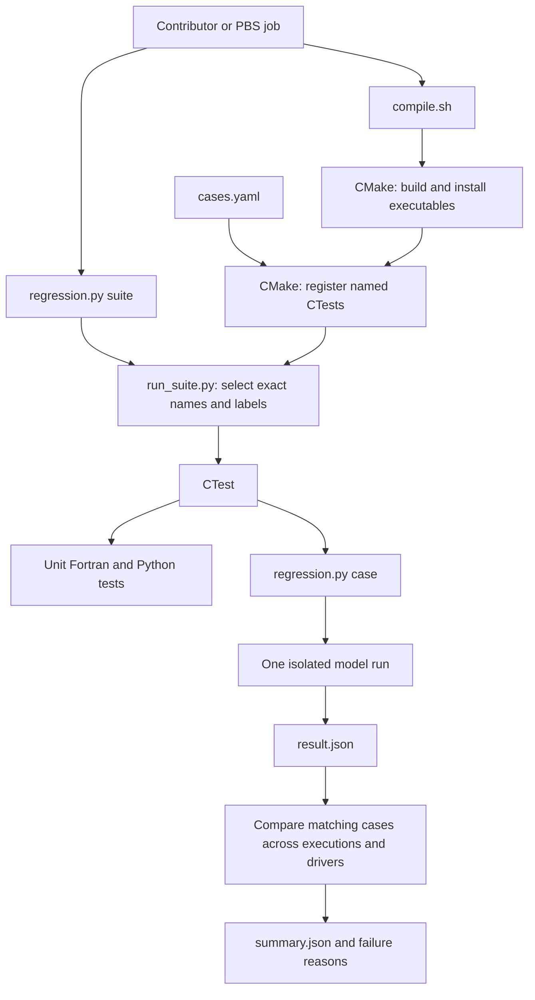
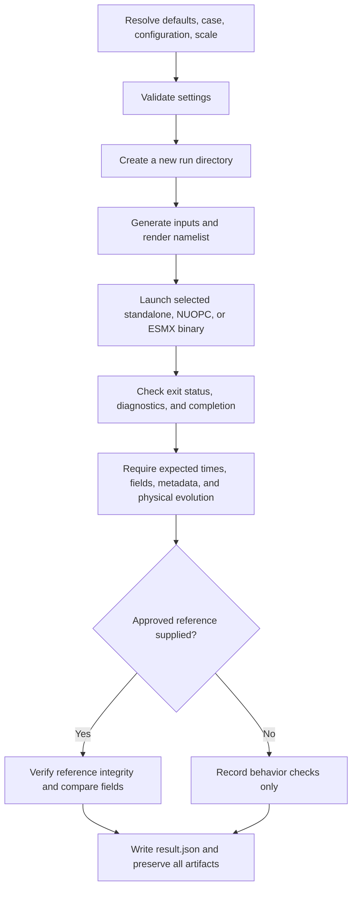

# Structure and execution

[Documentation index](../README.md)

`compile.sh` selects compiled capabilities. CTest registers and launches tests.
Python supplies deterministic inputs and evaluates outputs. Scientific settings
and the execution matrix are defined in [cases.yaml](../cases.yaml).

## One generated case

A suite additionally compares successful runs with the same case, configuration,
and scale. It never compares `u10m` against `u3d` or WENO against Godunov.
Execution settings are recorded separately and cannot alter science. It prefers standalone
serial as the reference when available, then the smallest available rank/thread
layout. A partial selection tests only that selection. For example, selecting
only NUOPC cannot establish agreement with standalone. Failed cases remain
failures and are not converted to passes because a dependent comparison is
absent.

## Files and responsibilities

| File | Responsibility |
| --- | --- |
| [regression.py](../regression.py) | Parse public commands and dispatch |
| [config.py](../config.py), [cases.yaml](../cases.yaml) | Resolve settings, validate supported options, enumerate tests |
| [CMakeLists.txt](../CMakeLists.txt) | Choose executables, launcher, labels, timeouts, processor counts |
| [run_case.py](../run_case.py) | Stage and execute one existing binary |
| [generate_inputs.py](../generate_inputs.py) | Construct deterministic NetCDF input fields |
| [render_namelist.py](../render_namelist.py) | Write exact namelist options; derive dates and input geometry |
| [check_outputs.py](../check_outputs.py) | Check output inventory, metadata, forcing, and fire evolution |
| [compare_outputs.py](../compare_outputs.py) | Compare every saved field and report spatial errors |
| [run_suite.py](../run_suite.py) | Select CTests and compare equivalent completed cases |
| [reports.py](../reports.py) | Save structured results and print their locations |
| [reference.py](../reference.py) | Create unapproved references and verify supplied references |
| [tests/](../tests/) | Test the Python infrastructure using synthetic arrays |
| [legacy/](../../legacy/README.md) | Preserve historical fixtures and comparisons |

The model or coupler selects MPI decomposition from its communicator. Runtime
rank/thread settings are separate from compilation. Namelist `num_tiles` and
`tile_strategy` control within-rank tiling. CTest reserves ranks × threads and
the PBS template runs CTest cases sequentially within the allocation.

The generated coupled runs currently reuse `esmfRun.config` and `fd_fire.yaml`
from `tests/legacy/`. `run_case.py` copies those files into each private run
directory. ESMX's clock and run sequence are generated from the resolved case,
so changing their location requires updating that staging path as well as the
legacy CMake registration.
